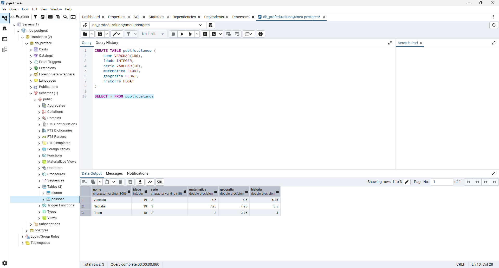
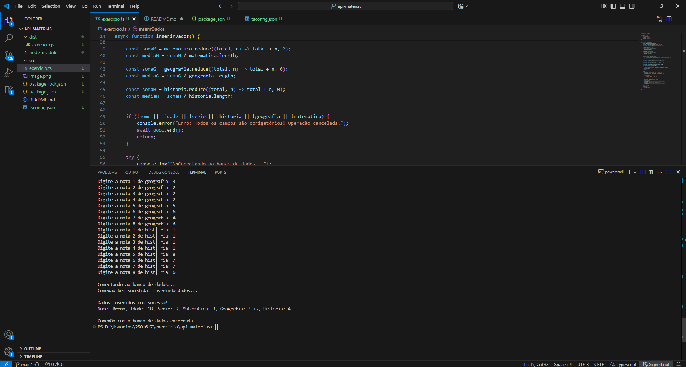

# Projeto de Cadastro de Alunos (Node.js + PostgreSQL + TypeScript)

Este projeto tem como objetivo realizar o **cadastro de alunos** e suas **notas** em um banco de dados **PostgreSQL**, calculando automaticamente as médias de cada matéria antes de salvar.

- Breno Miguel de Souza Afonso - RA: 2500998
- Nathalia Batista Munhoz - RA: 2501617
- Vanessa da Silva Santos - RA: 2520743

---

## Tecnologias Utilizadas

- **Node.js** – Ambiente de execução JavaScript  
- **PostgreSQL** – Banco de dados relacional  
- **TypeScript** – Superset do JavaScript com tipagem estática  
- **readline-sync** – Entrada de dados via terminal  
- **pg** – Cliente PostgreSQL para Node.js  

---

## Configuração do Ambiente

### 1. Instalar o Node.js
Baixe e instale o Node.js em:
[https://nodejs.org](https://nodejs.org)

Verifique se está instalado:
```bash
node -v
npm -v
```

Criar e acessar a pasta do projeto
```bash
git clone https://github.com/nathmunhoz/api-materias.git
cd api-materias
code .
```

Iniciar o projeto
```bash
npm init -y
```

Instalar dependências
```bash
npm install pg readline-sync
npm install -D typescript @types/pg @types/readline-sync
```

Criar a configuração do TypeScript
```bash
npx tsc --init

```

---
## Configuração do Banco de Dados




---
## Executando o Projeto

Compile o TypeScript e Execute:
```bash
npx tsc
node dist/exercicio.js
```

---
## Resultado Esperado
```bash
--- Cadastro de Aluno ---
Digite o nome: Ana
Digite a série: 8º Ano
Digite a idade: 13
Digite a nota 1 de matematica: 8
...
-----------------------------------------
Dados inseridos com sucesso!
Nome: Ana, Idade: 13, Série: 8º Ano, Matemática: 8.25, Geografia: 7.87, História: 9.12
-----------------------------------------
Conexão com o banco de dados encerrada.
```
